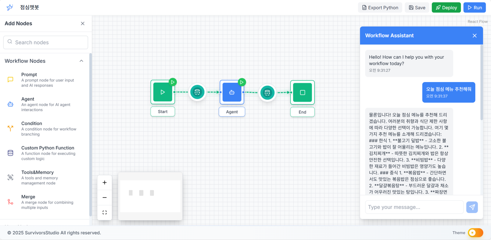
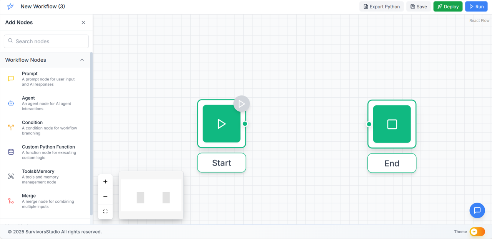
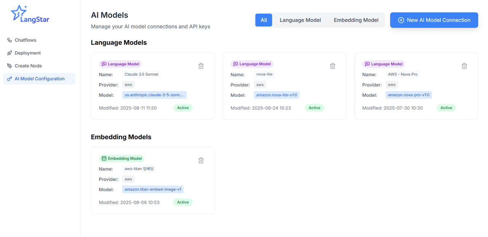
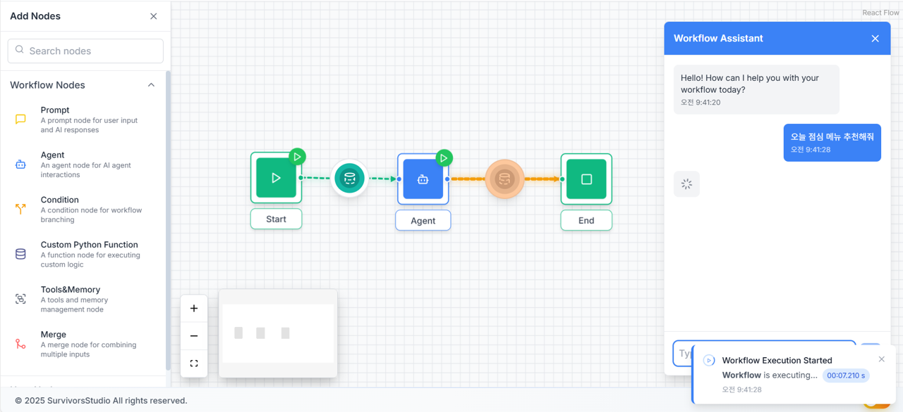
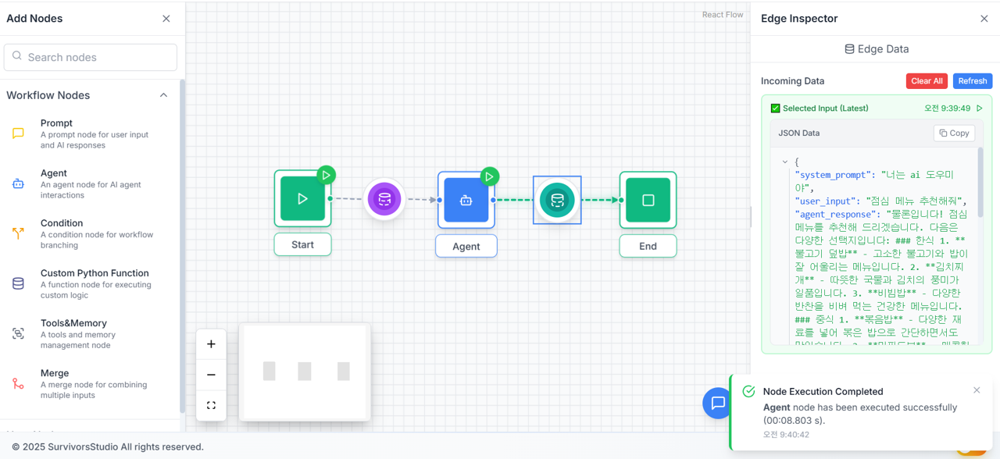

# 🌟 LangStar

[English](#english) | [한국어](#korean)

---

<a name="english"></a>
## English Version

> 🚧 **LangStar is currently under development.**
> This project is currently in active development. Features, structure, and documentation may change frequently.

**LangStar** is a visual no-code/low-code platform that enables both developers and non-developers to easily build **LLM-based agents** through a **drag-and-drop** interface. Built workflows are automatically converted to **Python code** and can be deployed.

---

### 🎯 Project Goals

- Lower the barrier to entry for LLM agent development
- Provide intuitive drag-and-drop based visual modeling
- Automatically generate clean, modularized Python code
- Provide one-click deployment and testing environment
- Save development time and improve accessibility

---

### 📤 Key Features

#### 🎨 Visual Workflow Builder
- Compose LLM agent workflows with **drag-and-drop interface**
- **Real-time node connection** and data flow visualization
- Support for **individual node execution** and debugging

#### 🔧 Various Node Types
- **Start Node**: Workflow starting point and initial variable setup
- **Prompt Node**: Prompt template creation and variable substitution
- **Agent Node**: LLM model execution (AWS Bedrock support)
- **Function Node**: User-defined Python function execution
- **User Node**: Custom Python code blocks
- **Condition Node**: Conditional branching
- **Merge Node**: Multi-input data merging
- **End Node**: Workflow termination point

#### 🤖 AI Model Connection Management
- **AWS Bedrock** fully supported (Claude, Nova, etc.)
- **OpenAI, Google, Anthropic** UI support (backend integration in progress)
- **API key and configuration management**
- **Model parameter adjustment** (temperature, max tokens, etc.)

#### 🚀 Local Execution and Testing
- **Automatic LangGraph code generation**
- **Local execution environment** and testing
- **Execution version management** and history
- **Real-time execution monitoring**
- **Execution log tracking**

#### 💾 Import/Export Features
- **Workflow JSON export/import**
- **AI connection settings backup/restore**
- **User node sharing**

#### 💬 Real-time Chat Interface
- **Real-time conversation with locally running agents**
- **Immediate workflow execution result confirmation**

---

### 🚀 Installation and Setup

#### System Requirements
- **Node.js** (v16 or higher)
- **Python 3.11 or higher**
- **npm** or **yarn**

#### Required Software Installation

**1. Node.js Installation**

**macOS (using Homebrew):**
```bash
# Install Homebrew (if not installed)
/bin/bash -c "$(curl -fsSL https://raw.githubusercontent.com/Homebrew/install/HEAD/install.sh)"

# Install Node.js
brew install node

# Check version
node --version
npm --version
```

**Ubuntu/Debian:**
```bash
# Add NodeSource repository
curl -fsSL https://deb.nodesource.com/setup_18.x | sudo -E bash -

# Install Node.js
sudo apt-get install -y nodejs

# Check version
node --version
npm --version
```

**Windows:**
1. Download LTS version from [Node.js official website](https://nodejs.org/)
2. Run installer
3. Check version in command prompt:
```cmd
node --version
npm --version
```

**2. Python 3.11+ Installation**

**macOS (using Homebrew):**
```bash
# Python 3.12 (recommended)
brew install python@3.12

# Or Python 3.11
brew install python@3.11
```

**Ubuntu/Debian:**
```bash
sudo apt update

# Python 3.12 (recommended)
sudo apt install python3.12 python3.12-venv python3.12-pip

# Or Python 3.11
sudo apt install python3.11 python3.11-venv python3.11-pip
```

**Windows:**
Download Python 3.11 or higher from [Python.org](https://www.python.org/downloads/)

#### Quick Start

1. **Clone repository**
   ```bash
   git clone <repository-url>
   cd langstar
   ```

2. **Install dependencies**
   ```bash
   npm install
   ```
   This command will automatically:
   - Install frontend dependencies (React)
   - Detect and use optimal Python version (3.11+)
   - Create Python virtual environment (`server/venv/`)
   - Install Python dependencies in virtual environment

3. **Run development server**
   ```bash
   npm run dev
   ```
   The following servers will be running:
   - **Frontend server** (React): `http://localhost:5173`
   - **Backend server** (FastAPI): `http://localhost:8000`

#### Safely Stop Server

**Recommended method (Ctrl+C):**
```bash
# In the terminal where langstar-dev is running
Ctrl + C
```

**Alternative method:**
```bash
# Stop all development processes
npm run stop-dev

# Clean ports when processes are stuck
npm run clean-ports

# Check port usage
npm run clean-ports:win32  # Windows
lsof -i:8000 -i:5173       # macOS/Linux
```

#### Individual Execution Commands

- **Frontend only**: `npm run dev --prefix ui`
- **Backend only**: `npm run server-dev`
- **Frontend dependencies only**: `npm install --prefix ui`
- **Backend dependencies only**: `npm run setup-python:darwin` (macOS/Linux) or `npm run setup-python:win32` (Windows)
- **Check Python version**: `npm run check-python`

#### Docker Execution (Optional)

```bash
# Run container environment
docker-compose up -d

# Access: http://localhost
```

> **Note**: For detailed Docker guide, see [DOCKER_README.md](DOCKER_README.md). Includes Windows support, production deployment, troubleshooting, and more.

#### Manual Python Setup (If Needed)
If you want to manually set up Python:

```bash
# Setup script automatically detects optimal Python version (3.11+)
npm run setup-python:darwin  # macOS/Linux
npm run setup-python:win32   # Windows

# Or manually:
# Create virtual environment with available Python 3.11+
python3.12 -m venv server/venv  # or python3.11, python3, python

# Activate virtual environment
# macOS/Linux:
source server/venv/bin/activate
# Windows:
server\venv\Scripts\activate

# Ensure pip installation and upgrade
python -m ensurepip --upgrade
python -m pip install --upgrade pip

# Install dependencies
pip install -r server/requirements.txt
```

#### Troubleshooting

**1. Node.js version too low:**
```bash
# Check current version
node --version

# If below v16, update Node.js using installation methods above
```

**2. Cannot find Python 3.11+:**
```bash
# Check available Python versions
python3.12 --version
python3.11 --version
python3 --version
python --version

# If not available, install using methods above
```

**3. Port already in use:**
```bash
# Check port usage
lsof -i:8000 -i:5173

# Kill processes using those ports
npm run clean-ports
```

**4. Permission errors (Linux/macOS):**
```bash
# Fix npm permissions
sudo chown -R $USER:$GROUP ~/.npm
sudo chown -R $USER:$GROUP ~/.config
```

**5. Virtual environment issues:**
```bash
# Delete existing venv and recreate
rm -rf server/venv
npm run setup-python:darwin  # setup-python:win32 for Windows
```

---

### 🖼️ Screenshots

1. **Workflow Creation**  
   Build LLM agent pipelines with drag-and-drop.

   

2. **Workflow and AI Connection Management**  
   Systematically manage agent flows, API keys, and execution settings.

   

3. **Real-time Agent Chat**  
   Chat in real-time with locally running agents based on completed workflows.

   

4. **Real-time Debugging - Individual Node Execution**  
   Execute and inspect each node individually during the design phase.  
   Check intermediate outputs and resolve issues early.

   

---

### 🏗️ Tech Stack

#### Frontend
- **React 18** + **TypeScript** + **Vite**
- **TailwindCSS** - Styling
- **Zustand** - State management
- **ReactFlow** - Visual workflow editing
- **Monaco Editor** - Code editing

#### Backend
- **FastAPI** + **Python 3.11+**
- **LangChain** + **LangGraph** - AI agent framework
- **AWS Bedrock** - Primary LLM model support
- **Uvicorn** - ASGI web server

> **Note**: AWS Bedrock models are fully supported. Other AI models (OpenAI, Google, etc.) will be supported gradually.

#### Deployment & Infrastructure
- **Docker** + **Docker Compose**
- **Cross-platform** development script support

---

### ⚠️ Current Limitations

#### 🔧 Features in Development
- **AI Model Support**: OpenAI, Google, Anthropic UI implemented, backend integration in progress
- **Cloud Deployment**: Currently only local execution supported, actual cloud deployment features planned
- **RAG Settings**: Basic UI exists, detailed features partially implemented

#### ✅ Fully Supported Features
- **AWS Bedrock** models (Claude, Nova, etc.)
- **Visual workflow builder** and all node types
- **Custom node** creation and management
- **Import/Export** features
- **Real-time debugging** and individual node execution
- **Local execution** environment

---

### 🎯 Project Story

Recently, our company went through a major restructuring. Many colleagues left during the process, and we found ourselves at the center of change. We also considered changing jobs, and many organizations wanted us. But somehow, we couldn't take that step.

The answer was simpler than we thought. What we truly wanted wasn't a new job. What we really wanted was to work together. So we started thinking about how we could survive and thrive together.

This project started that way. We needed a small space where we could work together. We didn't try to create something grand, but the goal was simple. To work in a way we enjoy, learn from each other, and create opportunities to grow together.

We don't want to lose any more colleagues. So we're creating a space where we work together, gather our energy, and build this project as a result.

---

### 📄 License and Contributing

#### License
This project is distributed under the **MIT License**. See [LICENSE](LICENSE) file for details.

#### Contributing
If you want to contribute to LangStar, please refer to [CONTRIBUTING.md](CONTRIBUTING.md). Detailed guidelines on contribution guidelines, development environment setup, coding styles, and more are provided.

#### Community Guidelines
All contributors must comply with our [Code of Conduct](CODE_OF_CONDUCT.md).

#### Third-Party Licenses
For license information on open source libraries used in this project, see [NOTICE](NOTICE) file.

---

<a name="korean"></a>
## 한국어 버전

> 🚧 **LangStar는 현재 개발 중입니다.**
> 이 프로젝트는 활발히 개발 중이며, 기능, 구조, 문서가 자주 변경될 수 있습니다.

**LangStar**는 개발자와 비개발자 모두가 **드래그 앤 드롭** 방식으로 **LLM 기반 에이전트**를 쉽게 구축할 수 있는 시각적 노코드/로우코드 플랫폼입니다. 구축된 워크플로우는 자동으로 **Python 코드**로 변환되어 배포할 수 있습니다.

---

## 🎯 프로젝트 목표

- LLM 에이전트 개발의 진입 장벽 낮추기
- 직관적인 드래그 앤 드롭 기반 시각적 모델링 제공
- 깔끔하고 모듈화된 Python 코드 자동 생성
- 원클릭 배포 및 테스트 환경 제공
- 개발 시간 절약 및 접근성 향상

---

## 📤 주요 기능

### 🎨 시각적 워크플로우 빌더
- **드래그 앤 드롭 인터페이스**로 LLM 에이전트 워크플로우 구성
- **실시간 노드 연결** 및 데이터 흐름 시각화
- **개별 노드 실행** 및 디버깅 지원

### 🔧 다양한 노드 타입
- **Start Node**: 워크플로우 시작점 및 초기 변수 설정
- **Prompt Node**: 프롬프트 템플릿 생성 및 변수 치환
- **Agent Node**: LLM 모델 실행 (AWS Bedrock 지원)
- **Function Node**: 사용자 정의 Python 함수 실행
- **User Node**: 커스텀 Python 코드 블록
- **Condition Node**: 조건부 분기 처리
- **Merge Node**: 다중 입력 데이터 병합
- **End Node**: 워크플로우 종료점

### 🤖 AI 모델 연결 관리
- **AWS Bedrock** 완전 지원 (Claude, Nova 등)
- **OpenAI, Google, Anthropic** UI 지원 (백엔드 구현 진행 중)
- **API 키 및 설정 관리**
- **모델 파라미터 조정** (온도, 최대 토큰 등)

### 🚀 로컬 실행 및 테스트
- **자동 LangGraph 코드 생성**
- **로컬 실행 환경** 및 테스트
- **실행 버전 관리** 및 히스토리
- **실시간 실행 모니터링**
- **실행 로그 추적**

### 💾 Import/Export 기능
- **워크플로우 JSON 내보내기/가져오기**
- **AI 연결 설정 백업/복원**
- **사용자 노드 공유**

### 💬 실시간 채팅 인터페이스
- **로컬 실행 에이전트와 실시간 대화**
- **워크플로우 실행 결과 즉시 확인**

---

## 🚀 설치 및 실행

### 시스템 요구사항
- **Node.js** (v16 이상)
- **Python 3.11 이상**
- **npm** 또는 **yarn**

### 필수 프로그램 설치

#### 1. Node.js 설치

**macOS (Homebrew 사용):**
```bash
# Homebrew 설치 (없는 경우)
/bin/bash -c "$(curl -fsSL https://raw.githubusercontent.com/Homebrew/install/HEAD/install.sh)"

# Node.js 설치
brew install node

# 버전 확인
node --version
npm --version
```

**Ubuntu/Debian:**
```bash
# NodeSource 저장소 추가
curl -fsSL https://deb.nodesource.com/setup_18.x | sudo -E bash -

# Node.js 설치
sudo apt-get install -y nodejs

# 버전 확인
node --version
npm --version
```

**Windows:**
1. [Node.js 공식 웹사이트](https://nodejs.org/)에서 LTS 버전 다운로드
2. 설치 프로그램 실행
3. 명령 프롬프트에서 버전 확인:
```cmd
node --version
npm --version
```

#### 2. Python 3.11+ 설치

**macOS (Homebrew 사용):**
```bash
# Python 3.12 (권장)
brew install python@3.12

# 또는 Python 3.11
brew install python@3.11
```

**Ubuntu/Debian:**
```bash
sudo apt update

# Python 3.12 (권장)
sudo apt install python3.12 python3.12-venv python3.12-pip

# 또는 Python 3.11
sudo apt install python3.11 python3.11-venv python3.11-pip
```

**Windows:**
[Python.org](https://www.python.org/downloads/)에서 Python 3.11 이상 버전 다운로드

### 빠른 시작

1. **저장소 클론**
   ```bash
   git clone <repository-url>
   cd langstar
   ```

2. **의존성 설치**
   ```bash
   npm install
   ```
   이 명령어는 자동으로 다음을 수행합니다:
   - 프론트엔드 의존성 설치 (React)
   - 최적의 Python 버전 감지 및 사용 (3.11+)
   - Python 가상환경 생성 (`server/venv/`)
   - Python 의존성 가상환경에 설치

3. **개발 서버 실행**
   ```bash
   npm run dev
   ```
   다음 서버들이 실행됩니다:
   - **프론트엔드 서버** (React): `http://localhost:5173`
   - **백엔드 서버** (FastAPI): `http://localhost:8000`

### 서버 안전하게 중지하기

**권장 방법 (Ctrl+C):**
```bash
# langstar-dev가 실행 중인 터미널에서
Ctrl + C
```

**대체 방법:**
```bash
# 모든 개발 프로세스 중지
npm run stop-dev

# 프로세스가 멈춰있을 때 포트 정리
npm run clean-ports

# 포트 사용 상황 확인
npm run clean-ports:win32  # Windows
lsof -i:8000 -i:5173       # macOS/Linux
```

### 개별 실행 명령어

- **프론트엔드만**: `npm run dev --prefix ui`
- **백엔드만**: `npm run server-dev`
- **프론트엔드 의존성만 설치**: `npm install --prefix ui`
- **백엔드 의존성만 설치**: `npm run setup-python:darwin` (macOS/Linux) 또는 `npm run setup-python:win32` (Windows)
- **Python 버전 확인**: `npm run check-python`

### Docker 실행 (선택사항)

```bash
# 컨테이너 환경 실행
docker-compose up -d

# 접속: http://localhost
```

> **참고**: Docker 상세 가이드는 [DOCKER_README.md](DOCKER_README.md)를 참조하세요. Windows 지원, 프로덕션 배포, 문제 해결 등이 상세히 안내되어 있습니다.

### 수동 Python 설정 (필요시)
수동으로 Python을 설정하고 싶다면:

```bash
# 설정 스크립트가 자동으로 최적의 Python 버전 감지 (3.11+)
npm run setup-python:darwin  # macOS/Linux
npm run setup-python:win32   # Windows

# 또는 수동으로:
# 사용 가능한 Python 3.11+로 가상환경 생성
python3.12 -m venv server/venv  # 또는 python3.11, python3, python

# 가상환경 활성화
# macOS/Linux:
source server/venv/bin/activate
# Windows:
server\venv\Scripts\activate

# pip 설치 및 업그레이드 확인
python -m ensurepip --upgrade
python -m pip install --upgrade pip

# 의존성 설치
pip install -r server/requirements.txt
```

### 문제 해결

#### 일반적인 문제들

**1. Node.js 버전이 너무 낮음:**
```bash
# 현재 버전 확인
node --version

# v16 미만이면 위의 설치 방법으로 Node.js 업데이트
```

**2. Python 3.11+ 찾을 수 없음:**
```bash
# 사용 가능한 Python 버전 확인
python3.12 --version
python3.11 --version
python3 --version
python --version

# 없으면 위의 방법으로 설치
```

**3. 포트가 이미 사용 중:**
```bash
# 포트 사용 상황 확인
lsof -i:8000 -i:5173

# 해당 포트 사용 프로세스 종료
npm run clean-ports
```

**4. 권한 오류 (Linux/macOS):**
```bash
# npm 권한 수정
sudo chown -R $USER:$GROUP ~/.npm
sudo chown -R $USER:$GROUP ~/.config
```

**5. 가상환경 문제:**
```bash
# 기존 venv 삭제 후 재생성
rm -rf server/venv
npm run setup-python:darwin  # Windows의 경우 setup-python:win32
```

---


## 🖼️ 스크린샷

1. **워크플로우 생성**  
   드래그 앤 드롭 방식으로 LLM 에이전트 파이프라인을 구축하세요.


   


2. **워크플로우 및 AI 연결 관리**  
   에이전트 플로우, API 키, 실행 설정을 체계적으로 관리하세요.


   


3. **실시간 에이전트 채팅**  
   완성된 워크플로우를 기반으로 로컬에서 실행되는 에이전트와 실시간으로 대화하세요.


   


4. **실시간 디버깅 - 노드별 개별 실행**  
   설계 단계에서 각 노드를 개별적으로 실행하고 검사하세요.  
   중간 출력을 확인하고 문제를 조기에 해결할 수 있습니다.


   

---

## 🏗️ 기술 스택

### 프론트엔드
- **React 18** + **TypeScript** + **Vite**
- **TailwindCSS** - 스타일링
- **Zustand** - 상태 관리
- **ReactFlow** - 시각적 워크플로우 편집
- **Monaco Editor** - 코드 편집

### 백엔드
- **FastAPI** + **Python 3.11+**
- **LangChain** + **LangGraph** - AI 에이전트 프레임워크
- **AWS Bedrock** - 주요 LLM 모델 지원
- **Uvicorn** - ASGI 웹서버

> **참고**: 현재 AWS Bedrock 모델이 완전히 지원되며, 다른 AI 모델들(OpenAI, Google 등)은 단계적으로 지원 예정입니다.

### 배포 & 인프라
- **Docker** + **Docker Compose**
- **크로스 플랫폼** 개발 스크립트 지원

---

## ⚠️ 현재 제한사항

### 🔧 개발 진행 중인 기능
- **AI 모델 지원**: OpenAI, Google, Anthropic는 UI만 구현되어 있고 백엔드 연동은 진행 중
- **클라우드 배포**: 현재는 로컬 실행만 지원, 실제 클라우드 배포 기능은 개발 예정
- **RAG 설정**: 기본 UI는 있으나 상세 기능은 부분적으로 구현됨

### ✅ 완전히 지원되는 기능
- **AWS Bedrock** 모델 (Claude, Nova 등)
- **시각적 워크플로우 빌더** 및 모든 노드 타입
- **사용자 정의 노드** 생성 및 관리
- **Import/Export** 기능
- **실시간 디버깅** 및 노드별 실행
- **로컬 실행** 환경

---

## 🎯 프로젝트 스토리

최근 저희 회사는 큰 구조조정을 겪었습니다. 그 과정에서 많은 동료들이 떠났고, 저희는 변화의 한복판에 서 있게 되었습니다. 저희도 이직을 고려했고, 많은 조직에서 저희를 원했습니다. 하지만 어쩐지 그 발걸음을 내딛을 수가 없었습니다.

답은 생각보다 간단했습니다. 저희가 진정으로 원했던 것은 이직이 아니었습니다. 저희가 정말로 원했던 것은 함께 일하는 것이었습니다. 그래서 저희는 어떻게 하면 함께 살아남고 번영할 수 있을까를 고민하기 시작했습니다.

이 프로젝트는 그렇게 시작되었습니다. 저희에게는 함께 일할 수 있는 작은 공간이 필요했습니다. 거창한 것을 만들려고 하지는 않았지만, 목표는 단순했습니다. 저희가 즐기는 방식으로 일하고, 서로로부터 배우고, 함께 성장할 수 있는 기회를 만드는 것이었습니다.

더 이상 동료를 잃고 싶지 않습니다. 그래서 저희는 함께 일하고, 에너지를 모으고, 그 결과로 이 프로젝트를 만들어가고 있는 공간을 만들고 있습니다.

---

## 📄 라이센스 및 기여

### 라이센스
이 프로젝트는 **MIT 라이센스** 하에 배포됩니다. 자세한 내용은 [LICENSE](LICENSE) 파일을 참조하세요.

### 기여하기
LangStar에 기여하고 싶으시다면 [CONTRIBUTING.md](CONTRIBUTING.md)를 참조하세요. 기여 가이드라인, 개발 환경 설정, 코딩 스타일 등이 상세히 안내되어 있습니다.

### 커뮤니티 가이드라인
모든 기여자는 우리의 [행동 강령(Code of Conduct)](CODE_OF_CONDUCT.md)을 준수해야 합니다.

### 서드파티 라이센스
이 프로젝트에서 사용하는 오픈소스 라이브러리의 라이센스 정보는 [NOTICE](NOTICE) 파일을 참조하세요.