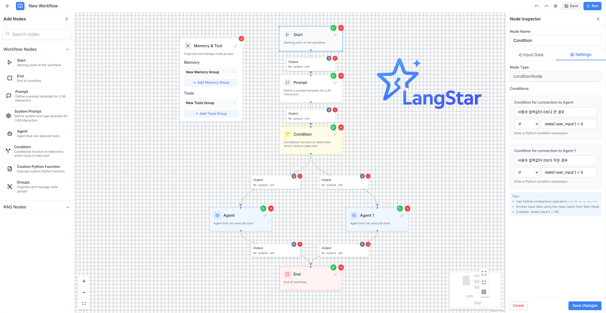
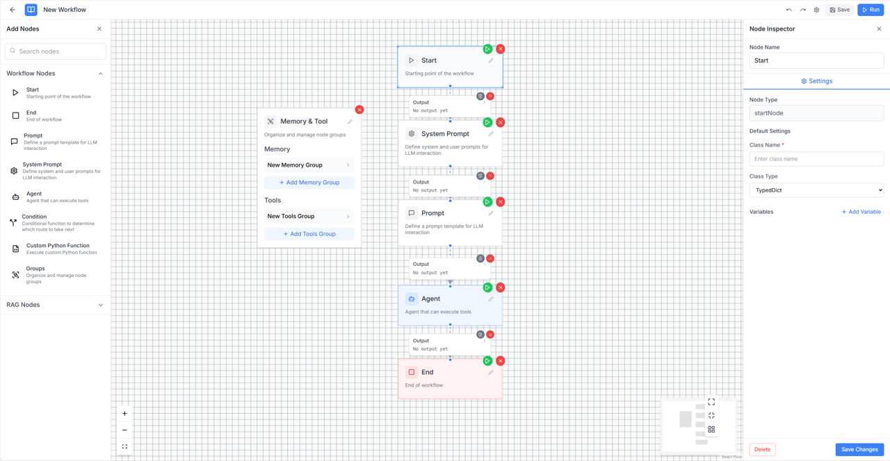

> 🚧 **Langstar is currently under development.**
> This project is currently in active development. Features, structure, and documentation may change frequently.


# 🌟 LangStar

**Langstar** is a visual platform that enables both developers and non-developers to easily create **LLM-based agent models** using **drag-and-drop** components. Once built, these models can be automatically converted into **Python code** for deployment.


---


## 🎯 Project Goals

- Lower the barrier to entry for non-developers working with LLM agents  
- Allow intuitive, drag-and-drop-based visual modeling  
- Automatically generate clean, modular Python code  
- Enable one-click deployment and testing  
- Save development time and promote accessibility


---


## 🚀 Installation & Setup

## 📤 Import/Export 기능

LangStar는 chatflow를 쉽게 공유하고 백업할 수 있는 import/export 기능을 제공합니다.

### Export 기능
- **전체 내보내기**: 모든 워크플로우와 관련 데이터를 JSON 파일로 내보냅니다
- **개별 내보내기**: 특정 워크플로우만 선택하여 내보낼 수 있습니다
- **워크플로우 목록에서**: 각 워크플로우 카드의 다운로드 아이콘을 클릭하여 개별 export

### Import 기능
- **JSON 파일 가져오기**: 유효한 Chatflow JSON 파일을 선택하여 워크플로우를 가져옵니다
- **자동 데이터 통합**: 워크플로우, AI 연결, 사용자 노드, 배포 정보를 모두 포함
- **중복 처리**: 기존 데이터와 중복되는 경우 덮어쓰기됩니다

### 사용 방법
1. 워크스페이스 사이드바에서 "Import/Export" 버튼 클릭
2. 내보내기 탭에서 전체 또는 개별 워크플로우 선택
3. 가져오기 탭에서 JSON 파일 선택하여 import
4. 워크플로우 목록에서 개별 다운로드 아이콘으로 빠른 export

### 주의사항
- 가져오기 전에 중요한 데이터를 백업하세요
- 유효한 Chatflow JSON 파일만 가져올 수 있습니다
- 기존 데이터와 중복되는 경우 덮어쓰기됩니다

### Prerequisites
- **Node.js** (v16 or higher)
- **Python 3.11 or higher** (required)
- **npm** or **yarn**

### Installing Prerequisites

#### 1. Node.js Installation

**macOS (using Homebrew):**
```bash
# Homebrew 설치 (없는 경우)
/bin/bash -c "$(curl -fsSL https://raw.githubusercontent.com/Homebrew/install/HEAD/install.sh)"

# Node.js 설치
brew install node

# 버전 확인
node --version
npm --version
```

**Ubuntu/Debian:**
```bash
# NodeSource 저장소 추가
curl -fsSL https://deb.nodesource.com/setup_18.x | sudo -E bash -

# Node.js 설치
sudo apt-get install -y nodejs

# 버전 확인
node --version
npm --version
```

**Windows:**
1. Download LTS version from [Node.js official website](https://nodejs.org/)
2. Run the installer
3. Check version in Command Prompt:
```cmd
node --version
npm --version
```

#### 2. Python 3.11+ Installation

**macOS (using Homebrew):**
```bash
# Python 3.12 (recommended)
brew install python@3.12

# Or Python 3.11
brew install python@3.11
```

**Ubuntu/Debian:**
```bash
sudo apt update

# Python 3.12 (recommended)
sudo apt install python3.12 python3.12-venv python3.12-pip

# Or Python 3.11
sudo apt install python3.11 python3.11-venv python3.11-pip
```

**Windows:**
Download from [Python.org](https://www.python.org/downloads/) (Python 3.11 or higher)

### Quick Start

1. **Clone the repository**
   ```bash
   git clone <repository-url>
   cd langstar
   ```

2. **Install dependencies**
   ```bash
   npm install
   ```
   This command will automatically:
   - Install frontend dependencies (React)
   - Detect and use the best available Python version (3.11+)
   - Create a Python virtual environment (`server/venv/`)
   - Install Python dependencies in the virtual environment

3. **Start development servers**
   ```bash
   npm run dev
   ```
   This will start both:
   - Frontend server (React) on `http://localhost:5173`
   - Backend server (FastAPI) on `http://localhost:8000`

### Stopping Services Safely

**Recommended method (Ctrl+C):**
```bash
# In the terminal where langstar-dev is running
Ctrl + C
```

**Alternative methods:**
```bash
# Stop all development processes
npm run stop-dev

# Clean up ports if processes are stuck
npm run clean-ports

# Check what's using the ports
npm run clean-ports:win32  # Windows
lsof -i:8000 -i:5173       # macOS/Linux
```

### Alternative Commands

- **Frontend only**: `npm run dev --prefix ui`
- **Backend only**: `npm run server-dev`
- **Install frontend only**: `npm install --prefix ui`
- **Install backend only**: `npm run setup-python:darwin` (macOS/Linux) or `npm run setup-python:win32` (Windows)
- **Check Python version**: `npm run check-python`

### Manual Python Setup (if needed)
If you prefer to set up Python manually:

```bash
# The setup script will automatically detect the best available Python version (3.11+)
npm run setup-python:darwin  # macOS/Linux
npm run setup-python:win32   # Windows

# Or manually:
# Create virtual environment with available Python 3.11+
python3.12 -m venv server/venv  # or python3.11, python3, python

# Activate virtual environment
# macOS/Linux:
source server/venv/bin/activate
# Windows:
server\venv\Scripts\activate

# Ensure pip is installed and upgrade it
python -m ensurepip --upgrade
python -m pip install --upgrade pip

# Install dependencies
pip install -r server/requirements.txt
```

### Troubleshooting

#### Common Issues

**1. Node.js version too old:**
```bash
# Check current version
node --version

# If below v16, update Node.js using the installation methods above
```

**2. Python 3.11+ not found:**
```bash
# Check available Python versions
python3.12 --version
python3.11 --version
python3 --version
python --version

# If none found, install using the methods above
```

**3. Port already in use:**
```bash
# Check what's using the ports
lsof -i:8000 -i:5173

# Kill processes using those ports
npm run clean-ports
```

**4. Permission errors (Linux/macOS):**
```bash
# Fix npm permissions
sudo chown -R $USER:$GROUP ~/.npm
sudo chown -R $USER:$GROUP ~/.config
```

**5. Virtual environment issues:**
```bash
# Remove existing venv and recreate
rm -rf server/venv
npm run setup-python:darwin  # or setup-python:win32 for Windows
```


---


# ✨ Key Features

- ✅ **Visual Agent Builder**  
  Drag-and-drop UI to visually compose agents, tools, memory blocks, and conditionals without writing a line of code.

- ✅ **Modular Architecture**  
  Components like LLMs, APIs, documents, RAG pipelines, and memory modules can be easily reused and extended.

- ✅ **Automatic Code Generation**  
  Instantly convert your workflow into production-ready Python code — readable and customizable.

- ✅ **Real-Time Block Execution for Debugging**  
  Execute each block independently during design time and immediately view inputs, outputs, and errors.  
  This dramatically improves debugging and understanding of how data flows through the agent.

- ✅ **Extensible for Developers**  
  For advanced users, Langstar offers hooks and customization options for logic and code injection.


---


## 🖼️ Screenshots
1. **Create your custom workflow**  
   Drag and drop components to build your own LLM agent pipeline.

   

2. **Manage workflows, API keys, and RAG settings**  
   Organize and configure your agent flows, keys, and retrieval-augmented generation (RAG) options.

   

3. **Chat with your agent in real time**  
   Interact with the deployed agent using a real-time chat interface based on your completed workflow.

   

4. **Debug in Real Time with Per-Block Execution**  
   Run and inspect each block individually during design.  
   Check intermediate outputs and fix issues early — no need to run the entire workflow every time.

   


---

## 🚀 Project Story
Recently, our company went through a major restructuring. During that process, many of our colleagues left, and we found ourselves right in the middle of the change. We did consider changing companies, and many organizations wanted us. But for some reason, we couldn't bring ourselves to take that step.


The answer was simpler than we thought. What we truly wanted wasn't a career change. What we really wanted was to work together. So, we started thinking about how we could survive and thrive together.


That's how this project started. We needed a small space where we could work together. We didn't set out to create something huge, but the goal was simple: to create an opportunity where we could work in a way we enjoy, learn from each other, and grow together.


We don't want to lose any more colleagues. That's why we're creating a space where we can work together, pooling our energy, and building this project as a result.